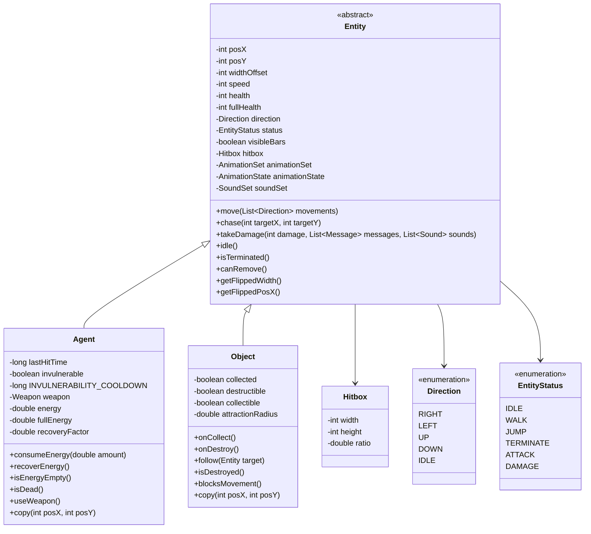
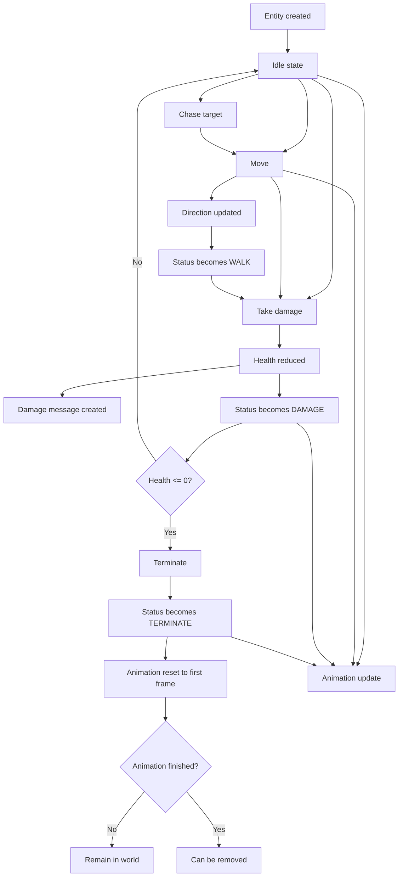

# Agent Package

The `chon.group.game.core.agent` package defines the core actor model of the game.

It is centered on the abstract class `Entity`, which provides the common structure for all interactive world elements, including position, movement, health, hitbox, animation, and sound support.

From this base, the package defines two main specializations:

- **Agent**: active entities capable of moving, chasing targets, receiving damage with temporary invulnerability, and using weapons.
- **Object**: passive world entities that may be collectible, destructible, and capable of following a target under attraction rules.

The package also includes supporting types for collision and state control:
- **Hitbox**
- **Direction**
- **EntityStatus**

## Main Classes

- **Entity**: abstract base class for all world entities.
- **Agent**: active entity with energy, invulnerability, and weapon support.
- **Object**: passive entity with collectible/destructible behavior.
- **Hitbox**: defines collision dimensions.
- **Direction**: movement orientation enum.
- **EntityStatus**: gameplay/animation status enum.

## Class Diagram

## Entity Behavior Flow

