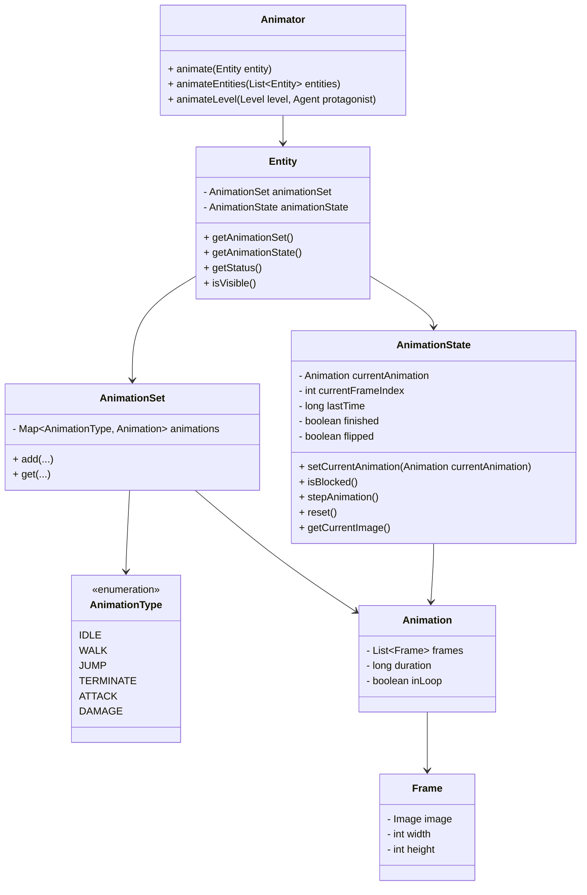
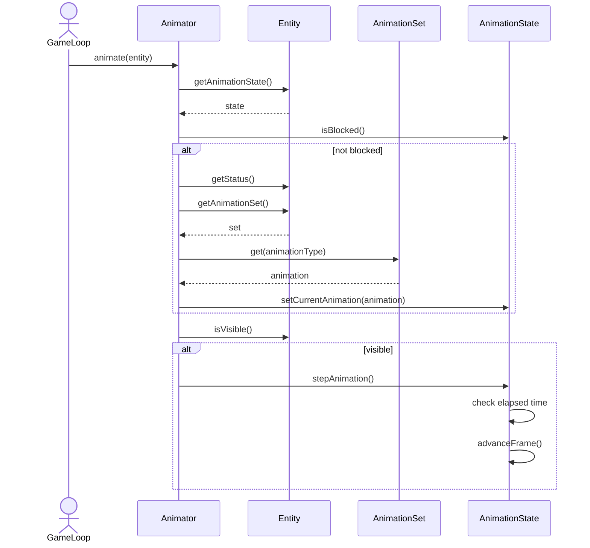

# Animation Package

The `chon.group.game.animation` package defines the animation system of the game, responsible for managing frames, animation transitions, and visual updates of entities.

This package separates **animation data**, **animation state**, and **animation control**, resulting in a modular and flexible design.

The animation system follows a **State + Strategy-like approach**:

- **State**: `AnimationState` maintains the runtime state of an animation (current frame, timing, finished status, flipped orientation).
- **Data (Composition)**: `Animation`, `Frame`, and `AnimationSet` define the structure and content of animations.
- **Controller (Strategy)**: `Animator` dynamically selects and updates animations based on the entity's current status.
- **Integration Point**: `Entity` connects gameplay state to the animation subsystem by holding both an `AnimationSet` and an `AnimationState`.

This separation allows animations to be reused, switched dynamically, and updated independently of game logic, while still being directly attached to each game entity.

## Main Concepts

- **Frame**: represents a single image with dimensions.
- **Animation**: a sequence of frames with duration and loop behavior.
- **AnimationSet**: a collection of animations indexed by `AnimationType`.
- **AnimationState**: manages the current animation execution (frame index, timing, completion).
- **Animator**: responsible for selecting and updating animations based on entity state.
- **AnimationType**: enumeration of possible animation categories (IDLE, WALK, ATTACK, etc.).
- **Entity**: owns the animation configuration and runtime animation state used by the animator.

## Class Diagram

The class diagram now makes the architecture more explicit: `Entity` is the object that owns both the available animations (`AnimationSet`) and the current runtime animation execution (`AnimationState`). The `Animator` does not store animation data itself; instead, it operates on each entity by reading its gameplay state and updating the animation objects attached to it.

## Animation Update Flow

This version makes the runtime responsibility clearer:

- The **Entity** owns the animation resources and current animation progress.
- The **Animator** decides which animation should be active based on the entity state.
- The **AnimationState** controls frame progression and termination behavior.
- The **AnimationSet** provides the correct animation for each gameplay status.

