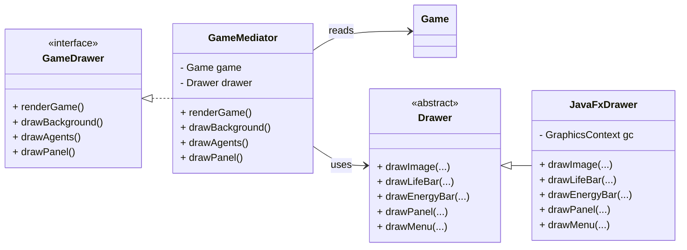
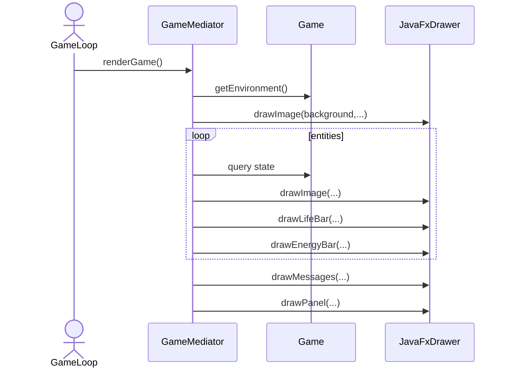

# Drawer Package (GoF-Oriented)

The `chon.group.game.drawer` subsystem is responsible for rendering the visual state of the game on screen.

This design follows the **Mediator pattern** with a clear separation between coordination and rendering:

- **Abstract Mediator**: `GameDrawer`
- **Concrete Mediator**: `GameMediator`
- **Abstract Colleague**: `Drawer`
- **Concrete Colleague**: `JavaFxDrawer`

The mediator (`GameMediator`) controls *what* should be rendered and *when*, while the drawer (`Drawer`) defines *how* rendering is performed.

Only the `Game` is exposed as the external system, from which the mediator retrieves state.

## Class Diagram (GoF Layout)

## Rendering Flow

## Interpretation

- The **Mediator** centralizes rendering logic and removes direct dependencies between the game model and the UI.
- The **Drawer hierarchy** encapsulates rendering technology (JavaFX in this case).
- The system is extensible: new rendering backends can be added without changing the mediator logic.

