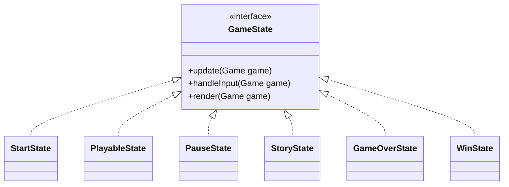
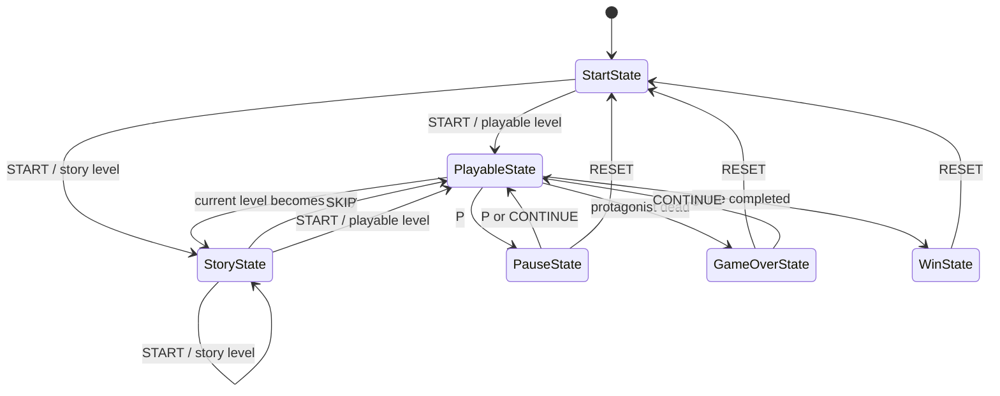

# States Package

The `chon.group.game.states` package implements the game flow using the State Pattern.

Each state implements the `GameState` interface, which defines three core responsibilities:

- `handleInput(Game game)`
- `update(Game game)`
- `render(Game game)`

This package is responsible for controlling how the game behaves in each major mode, such as start menu, active gameplay, pause, story screens, game over, and victory.

## Main Classes

- **GameState**: interface for all game states.
- **StartState**: handles the initial menu and starting the game.
- **PlayableState**: handles main gameplay input, world update, transitions, and rendering.
- **PauseState**: handles the pause menu and paused-world behavior.
- **StoryState**: handles story/menu progression between playable sections.
- **GameOverState**: handles retry and reset after defeat.
- **WinState**: handles the final victory state.

## Class Diagram

## State Transition Diagram

This diagram represents the transition flow among the main game states in the `chon.group.game.states` package.

The game starts in `StartState`, where the player can begin the game and move either to `PlayableState` or `StoryState`, depending on the type of the first loaded level.

`PlayableState` is the central gameplay state. From it, the game may transition to:
- `PauseState`, when the player pauses the game;
- `GameOverState`, when the protagonist dies;
- `WinState`, when the game is completed;
- `StoryState`, when the next level is a story segment.

`PauseState` temporarily interrupts gameplay but allows the player to either continue the game or reset back to `StartState`.

`StoryState` represents non-playable narrative screens. From there, the player may skip directly to `PlayableState` or continue progression to another `StoryState` or `PlayableState`, depending on the next level type.

`GameOverState` allows the player either to reset the whole game and return to `StartState` or to continue by restarting the current playable level.

`WinState` represents the end of the game and allows the player to reset back to `StartState`.

Overall, the diagram highlights how the State Pattern organizes the game flow by assigning a specific behavior to each execution mode and defining explicit transitions between them.

