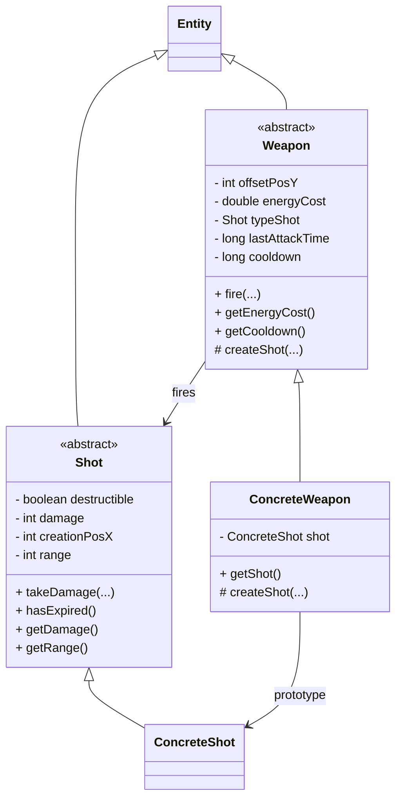
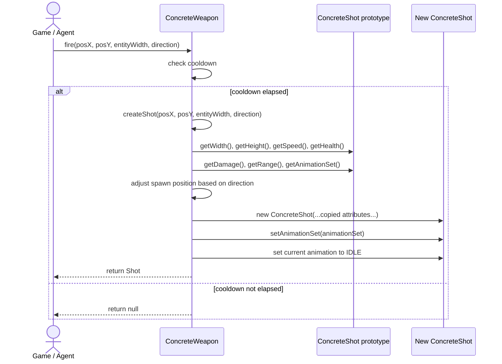

# Weapon Package

The `chon.group.game.core.weapon` package defines the combat mechanics of the game, including weapons and projectiles.

It is centered on the abstract classes `Weapon` and `Shot`, which extend the core `Entity` and provide the foundation for attack behavior and projectile lifecycle.

This package follows a combination of **Abstract Factory** and **Prototype** design patterns:

- **Abstract Factory**: `Weapon` defines the abstract method `createShot(...)`, delegating the creation of projectiles to concrete implementations.
- **Prototype**: `ConcreteWeapon` holds a reference to a `ConcreteShot` and uses it as a template to instantiate new shots during runtime, copying its attributes dynamically.

This approach allows flexible creation of different weapon/shot combinations while avoiding tight coupling and enabling reuse of configured projectile templates.

## Main Concepts

- **Weapon**: responsible for firing projectiles, managing cooldown, and energy cost.
- **Shot**: represents a projectile with damage, range, and optional destructibility.
- **ConcreteWeapon**: implements projectile creation using a prototype `ConcreteShot`.
- **ConcreteShot**: concrete implementation of a projectile.

## Class Diagram

The class diagram shows that `Weapon` and `Shot` are the two abstract foundations of the package. `ConcreteWeapon` specializes `Weapon` and keeps a reference to a `ConcreteShot`, which acts as a configured prototype. When the weapon fires, it does not build a projectile completely from scratch in an ad hoc way; instead, it creates a new instance based on the stored shot template, preserving the expected projectile characteristics such as speed, health, damage, range, and animation settings.

## Firing and Prototype-Based Shot Creation

The following sequence diagram illustrates how a projectile is created when a weapon is fired. First, `fire(...)` checks whether the cooldown has elapsed since the last attack. If firing is allowed, the weapon delegates projectile creation to `createShot(...)`. In the concrete implementation, `ConcreteWeapon` reads the attributes of its internal `ConcreteShot` prototype, adjusts the spawn position according to direction and entity width, and creates a new `ConcreteShot` instance with copied parameters. The new shot then receives the appropriate animation configuration before being returned.

This interaction makes the pattern combination explicit:

- The **factory role** is represented by the abstract `createShot(...)` method declared in `Weapon` and implemented by `ConcreteWeapon`.
- The **prototype role** is represented by the internal `ConcreteShot` stored inside `ConcreteWeapon`, whose state is used as a template for each newly created projectile.

As a result, the package supports extensibility in two directions at once: new weapon families can provide their own creation logic, and each weapon can reuse a preconfigured projectile prototype without hardcoding every projectile attribute repeatedly.